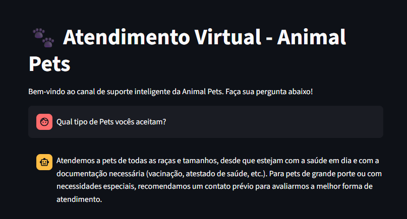

# 🐾 Assistente Virtual de Atendimento - Animal Pets

Este projeto foi desenvolvido como parte do **Challenge Alura Agente**. Trata-se de um assistente de atendimento virtual inteligente baseado na arquitetura **RAG (Retrieval-Augmented Generation)**, capaz de analisar uma base de conhecimento corporativa híbrida (manuais em PDF e tabelas em Markdown) e responder a dúvidas de clientes de forma automatizada, empática e contextualizada.

---

## 🏗️ Arquitetura do Projeto

A solução utiliza técnicas modernas de inteligência artificial generativa e processamento híbrido para mitigar perdas de contexto comuns em tabelas dentro de arquivos PDF:

1. **Ingestão Híbrida de Dados:** Documentos de texto corrido (como FAQs) são mantidos em formato `.pdf` e processados pelo `PyPDFLoader`. Listas de valores e tabelas de serviços complexas foram convertidas para o formato `.md` (Markdown) e processadas pelo `UnstructuredMarkdownLoader`, garantindo o alinhamento perfeito de preços.
2. **Processamento de Dados:** Divisão automática de toda a pasta `data/` em fragmentos lógicos (*text chunks*) utilizando o `RecursiveCharacterTextSplitter` com tamanho de bloco ajustado (`chunk_size=700`, `chunk_overlap=150`) para não quebrar informações financeiras.
3. **Embeddings Locais:** Geração de vetores semânticos com o modelo open-source leve `BAAI/bge-small-en-v1.5` via HuggingFace, garantindo eficiência de memória na nuvem.
4. **Banco de Vetores:** Armazenamento e busca por similaridade de alta performance utilizando o `ChromaDB`, configurado para recuperar os 7 blocos mais relevantes (`k=7`).
5. **Orquestrador LLM:** Uso de pipelines modernos em cadeia (LCEL) interligados à infraestrutura ultra veloz da **Groq Cloud** rodando o modelo de linguagem de grande porte `llama-3.3-70b-versatile`.
6. **Interceptação de Fluxo:** Comandos como "sair", "fechar" ou "encerrar" são filtrados diretamente na interface gráfica, poupando requisições desnecessárias à API.

---

## 🚀 Como Executar a Aplicação Localmente

### Pré-requisitos
* Python 3.10 ou superior instalado.

### Configuração do Ambiente

1. Clone este repositório para a sua máquina:
   ```bash
   git clone https://github.com
   cd seu-repositorio
   ```

2. Crie e ative o seu ambiente virtual Python:
   ```bash
   python -m venv .venv
   # No Windows (PowerShell):
   .venv\Scripts\Activate.ps1
   # No Linux/Mac:
   source .venv/bin/activate
   ```

3. Instale todas as dependências do projeto contidas no gerenciador:
   ```bash
   pip install -r requirements.txt
   ```

4. Crie um arquivo chamado `.env` na raiz do projeto e configure a sua chave secreta da API da Groq:
   ```env
   GROQ_API_KEY=gsk_sua_chave_aqui
   ```

### Execução da Interface Gráfica (Streamlit no Navegador)

Para rodar a aplicação web interativa no seu navegador, execute o comando abaixo:
```bash
streamlit run src/app_web.py
```
A aplicação abrirá automaticamente no endereço local `http://localhost:8501`.

---

## 💬 Exemplos de Interação com o Agente

### Exemplos de Perguntas Respondidas pelo Manual:
- *"Qual o valor do Táxi Dog para um raio de até 3 km?"*
- *"O que acontece se meu animal estiver com pulgas no banho?"*
- *"Quais são as opções de tosa disponíveis?"*

### Exemplo de Resposta Gerada (Informação Existente):
> **Cliente:** *Qual o valor do Táxi Dog até 3km?*  
> **Agente Animal Pets:** *O serviço de Táxi Dog para um raio de até 3 km possui o valor fixo de R$ 15,00 para ida e volta na segurança do seu lar.*

### Exemplo de Resposta de Segurança (Informação Ausente):
> **Cliente:** *Vocês vendem ração de gato de alguma marca específica?*  
> **Agente Animal Pets:** *Desculpe, não encontrei essa informação no meu manual. Por favor, entre em contato com nosso suporte humano para que possamos te ajudar melhor!*

---

## 🧪 Testes Automatizados

O projeto conta com uma suíte de testes unitários para garantir a confiabilidade da inicialização da IA e a integridade do formato de saída das respostas. Para executá-los, use o comando:

```bash
pytest tests/
```

---

## ☁️ Deploy em Nuvem (Oracle Cloud Infrastructure - OCI)

A aplicação foi projetada e conteinerizada via Docker de forma otimizada para o ambiente Always Free da **Oracle Cloud (OCI)**, permitindo execução contínua com consumo mínimo de recursos computacionais graças à hibridização de chamadas via API de texto e embeddings locais eficientes.


